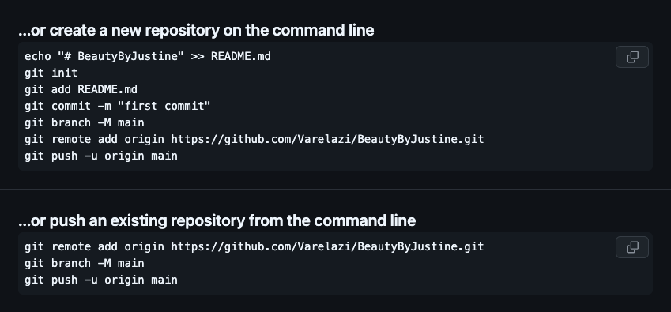
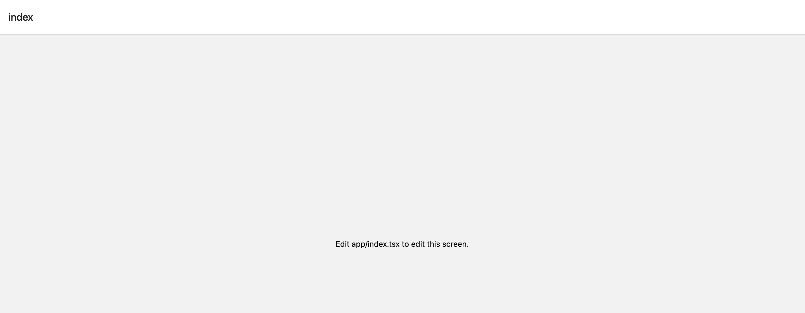

  <h1>Justine's Beauty Portfolio!</h1>
  <h5>Helpful Link To Create React Native App: https://docs.expo.dev/get-started/start-developing/ </h5>

  <h3>✅ 1. Create App</h3>
  <pre><code>
   $ cd Desktop
   $ nvm install node
   $ npm install -g expo-cli
   $ npx create-expo-app AppName
   $ cd AppName
   $ npx expo start
  </code></pre>

   <h5 style="color: red;">‼️ ERROR ‼️</h5>

   🔴 If you get this error: 
  <pre><code>
   node:events:497
         throw er; // Unhandled 'error' event
         ^

   Error: EMFILE: too many open files, watch
      at FSEvent.FSWatcher._handle.onchange (node:internal/fs/watchers:207:21)
   Emitted 'error' event on NodeWatcher instance at:
      at FSWatcher._checkedEmitError (/Users/ilenevarela-zul/Desktop/BeautyByJustine/node_modules/metro-file-map/src/watchers/NodeWatcher.js:82:12)
      at FSWatcher.emit (node:events:519:28)
      at FSEvent.FSWatcher._handle.onchange (node:internal/fs/watchers:213:12) {
   errno: -24,
   syscall: 'watch',
   code: 'EMFILE',
   filename: null
   }

   Node.js v22.9.0
   </code></pre>
   🔴 OR
  <pre><code>
   ilenevarela-zul@Ilenes-MacBook-Air BeautyByJustine % npm run android

   > beautybyjustine@1.0.0 android
   > expo start --android

   Starting project at /Users/ilenevarela-zul/Desktop/BeautyByJustine
   (node:39983) [DEP0040] DeprecationWarning: The `punycode` module is deprecated. Please use a userland alternative instead.
   (Use `node --trace-deprecation ...` to show where the warning was created)
   Starting Metro Bundler
   Error: EMFILE: too many open files, watch
      at FSEvent.FSWatcher._handle.onchange (node:internal/fs/watchers:207:21)
  </code></pre>

   🟢 Run:
   <pre><code>
   $ rm -rf node_modules
   $ npm cache clean --force
   $ npm install
   </code></pre>
   🟢 And:
   <pre><code>
   $ ulimit -n 
   (To check how many files are opened)
   $ ulimit -n ####  
   (To increase number of files you can have opened)
   </code></pre>
   Then start the app again! 

   <h5 style="color: red;">‼️ End of ERROR ‼️</h5>

   <h3>✅ 2. Connecting to GitHub </h3>
   

   <h3>✅ 3. Start Creating App! </h3>
      <h4>Create a blank branch first!</h4>
      <h4>✏️ Restart you app to a blank slate so you can start your project!</h4>
   <pre><code>
      $ npm run reset-project 

   </code></pre>
      <h4>✏️ Lets get rid of the React Native default Layout! </h4>
      
   <pre><code>
      ⏺ To get rid of this (In your _layout.tsx file) 
      import { Stack } from "expo-router";

      export default function RootLayout() {

      return (
         <Stack screenOptions={{ headerShown: false, }}>
            <Stack.Screen name="index" />
         </Stack>
      );
      }
   </code></pre>

   <h4>✏️ To allow the mobile status bar to show (This is how the current app will showcase the status bar)</h4>
   <pre><code>
       useEffect(() => {
         StatusBar.setBarStyle("light-content");
         StatusBar.setBackgroundColor("black");
      }, []);
   </code></pre>

   <h4>✏️ To allow work to be on the botton of status bar, not behind. </h4>
   <pre><code>
      <ScrollView contentContainerStyle={styles.scrollView} style={styles.container} showsVerticalScrollIndicator={false} > 
      🟢 contentContainerStyle={styles.scrollView} = Used to apply styles to the inner content of the ScrollView 
      🟢 style={styles.container} = Style applied to the ScrollView itself
      🟢 showsVerticalScrollIndicator={false} = Shows or hides the vertical scroll indicator (set to false to hide it)
      const styles = StyleSheet.create({
         Style for the main container, sets background color, flex behavior, and borders
         container: {
            backgroundColor: "black", 
             - Background color of the main container
            flex: 1,  
             - Allow the container to expand and fill available space
            borderColor: "red", 
             - Red border color for visual debugging
            borderWidth: 3, 
             - Width of the border
         },
         Style for the ScrollView's content, with padding to accommodate the status bar
         scrollView: {
            paddingTop: Platform.OS === "android" ? StatusBar.currentHeight : 0, 
             - Adds top padding equal to the status bar height for Android
         },
         Style for the content inside the ScrollView, allowing it to grow and be centered
         content: {
            flexGrow: 1, 
             - Allows the content to grow to fill the ScrollView
            alignItems: "center", 
             - Centers the content horizontally
            justifyContent: "center", 
             - Centers the content vertically
         },
      });
   </code></pre>

   <h4></h4>

